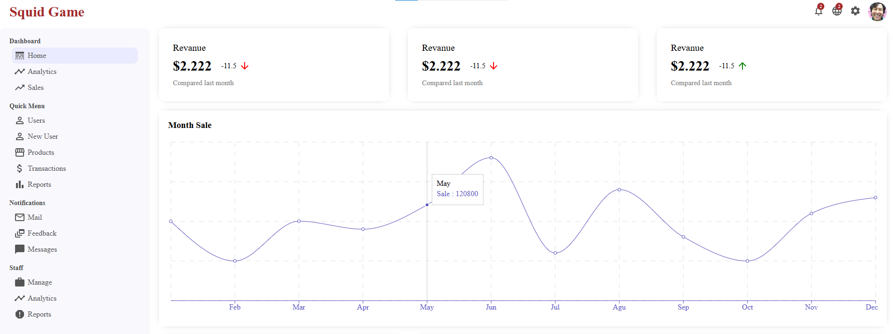
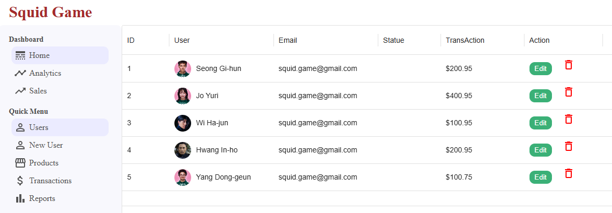
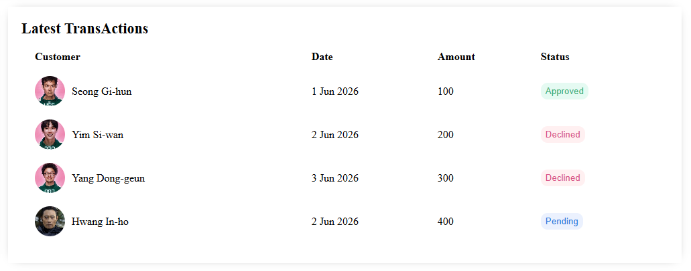
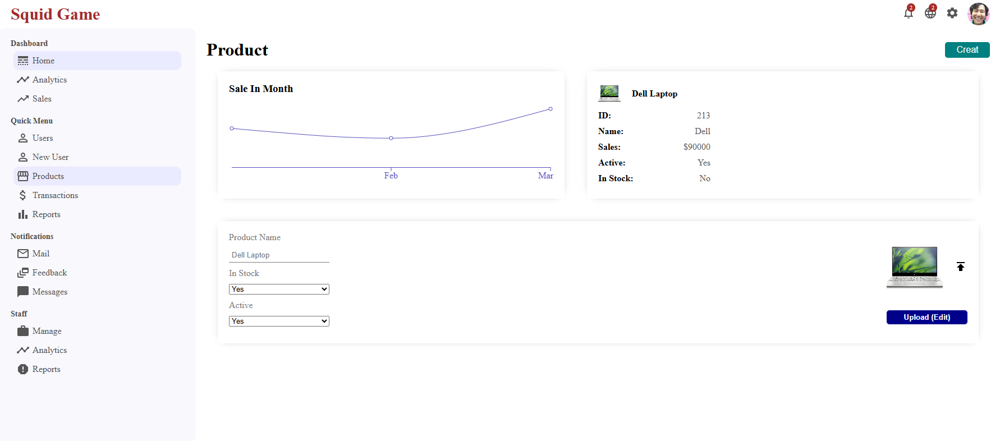

# Squid Game CMS

A simple Content Management System (CMS) panel with a design inspired by the Squid Game series. This project is built for managing users, products, transactions, and viewing sales reports.

## 🚀 Technologies Used

- **React 19** - Main library for building the user interface
- **React Router DOM 7** - Routing management
- **Material UI (MUI) 9** - Modern and customizable components
- **MUI X Data Grid** - Advanced tabular data display
- **MUI Icons** - Beautiful icons
- **Recharts 3** - Analytical charting

## 📋 Available Menus

**Dashboard**

- Home

**Quick Menu**

- Users
- Products
- Product Details

## ⚠️ Project Status

This project is currently in a preliminary/basic stage. For professional use, improvements such as the following are needed:

- Connection to a real backend
- User authentication
- Form validation
- Error handling
- Performance optimization

## 📝 Additional Notes

- All data displayed in tables and charts is currently static
- For real-world use, data should be fetched from an API
